# Game Hub

## Table of Contents 

- [Description](#description)
- [What we learned](#what-we-learned)
- [Installation](#installation)
- [Usage](#usage)
- [Credits](#credits)
- [License](#license)
- [Features](#features)

## Description

Game Hub is an application created for users who are interested in games and allows them to expand that interest or hobby. This application has users login or register to enhance their gaming experience by adding games to their profile, leaving reviews, and adding likes or dislikes for their pleasure. A user can see what games other users are playing as well.

## What we learned

- Utilize Apollo Server and GraphQL through React
- Use JWT authorization
- Set state and use hooks in React
- Deploy MongoDB to Heroku
- Use Github projects to complete issues
- Work with a team of developers

## Installation

This program can be run through a browser using the link to the deployed application. Alternatively, to run this application locally you will need to:

- Navigate to https://github.com/jennyrae818/game-hub
- Clone the Github repository to recieve all of the files
- Run `npm run install` in the command line of your terminal to set up all of the dependencies.
- Populate the existing database items by running `npm run seed` in your terminal
- Run `npm run develop` to start the application and begin using it.

## Usage

Use the deployed URL, https://game-hub-2022.herokuapp.com/ to open the deployed application.
When the user visits the page for the first time 
Then the user is presented with the home page containing the website title, links to login sign-up, a search bar and a list of games shown from the games database

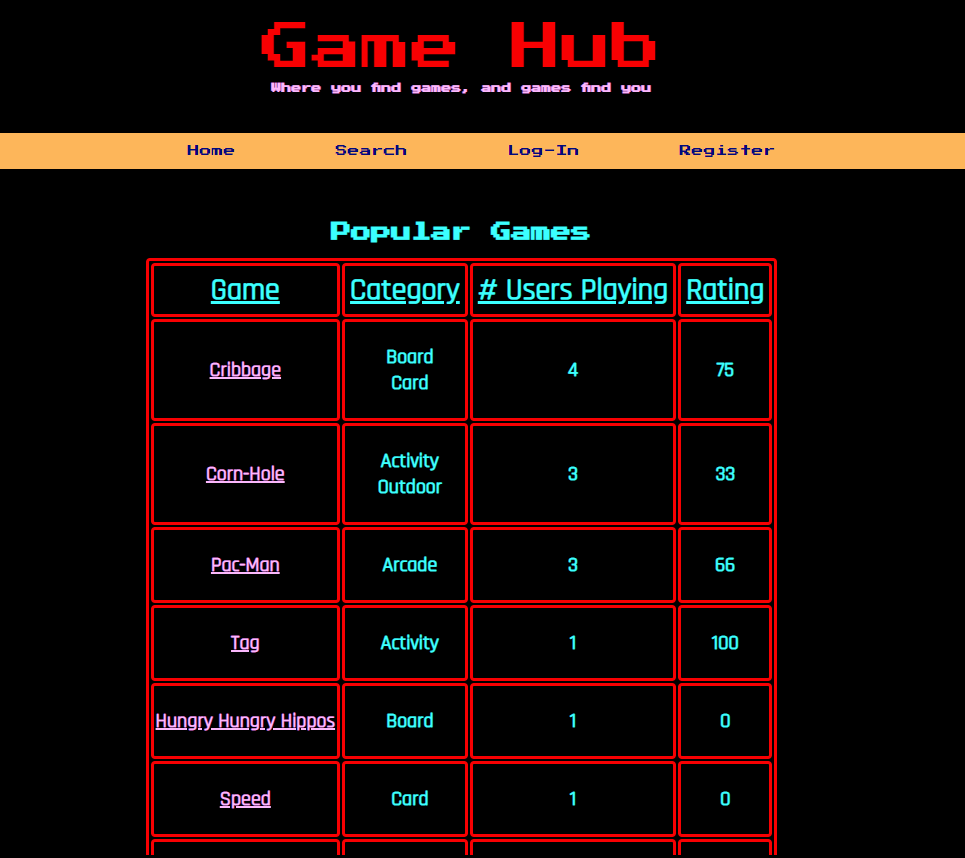

When the user chooses to sign up by clicking on the Register link.
Then the user will be taken to a page to enter in their email along with their desired username and password.

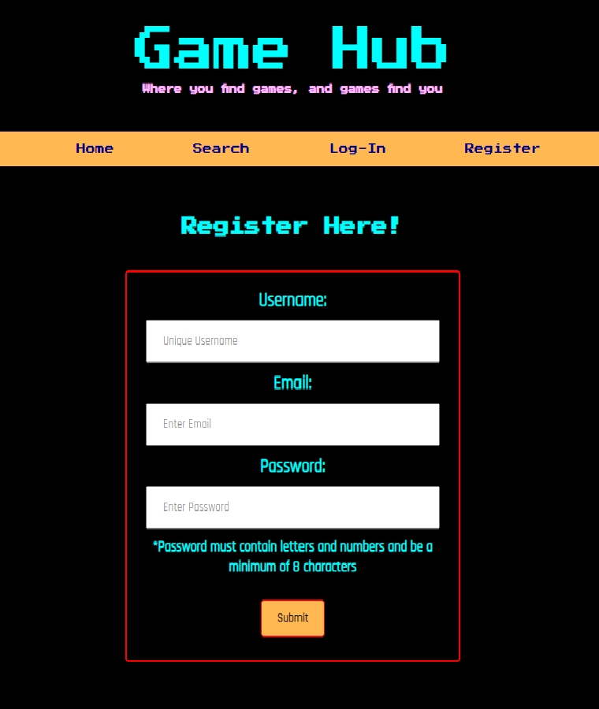

When the user finishes signing up by clicking the sign up button.
Then the user’s credentials are saved and they are logged into the site with a token and redirected to a modified home page that shows add game, view-profile and logout links.

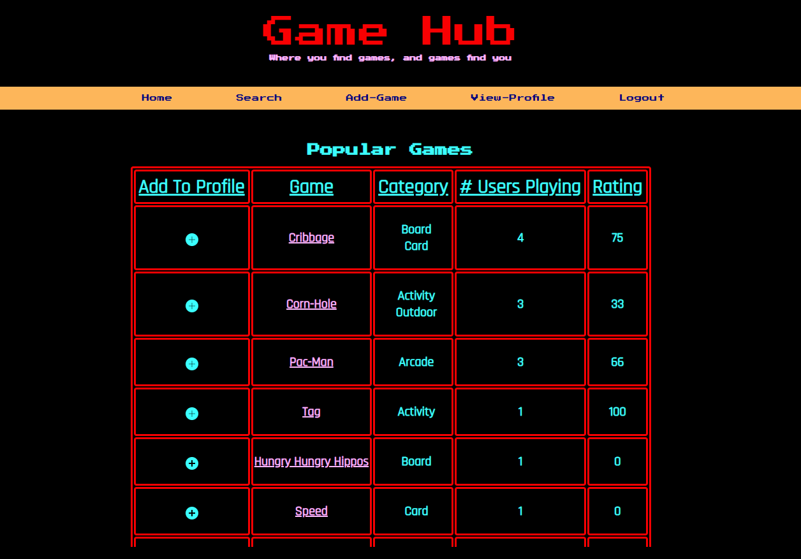

When the user revisits the site at a later time and chooses to login.
Then the user is prompted to enter their username and password.
When the user clicks to login to the website with their username and password
Then the user will be redirected to the modified home page.

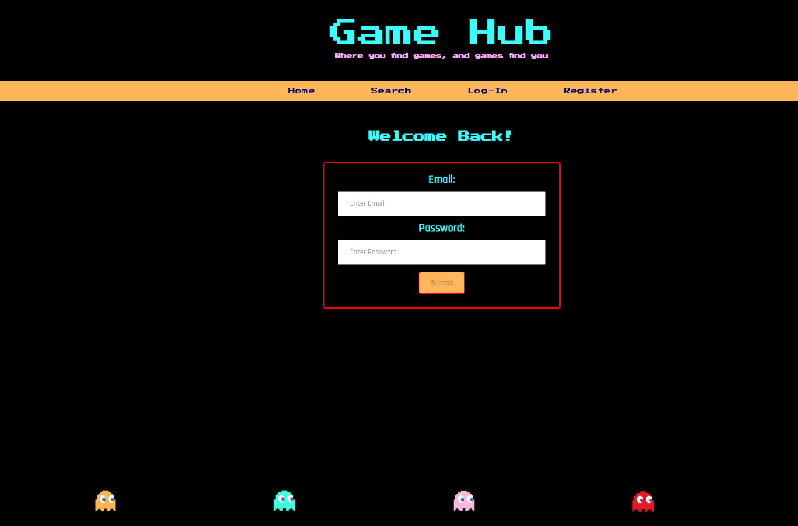

When the user revisits the website within 2 hours of logging in
Then the modified home page will be rendered.

When an unauthorized/authorized user clicks on the search bar
Then they will be taken to a page where they can search for a game by its name and type

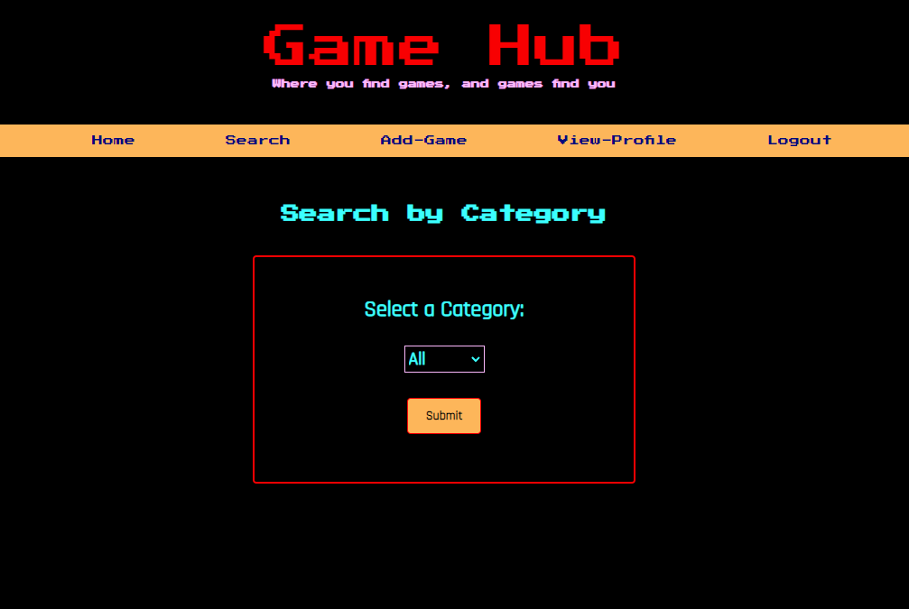

When an unauthorized/authorized user searches for a game
Then they will be brought to a page that filters games by category

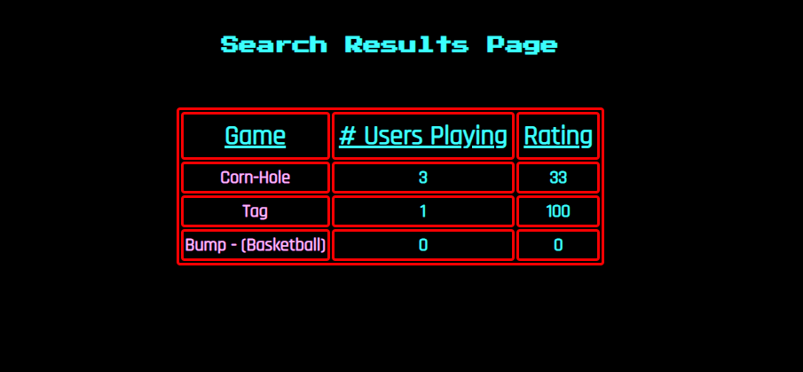

When an unauthorized/authorized user clicks on a game title
Then they will be brought to a page with the games description and a list of users who have rated the game, the likes and dislikes for the game and will see reviews left by other users

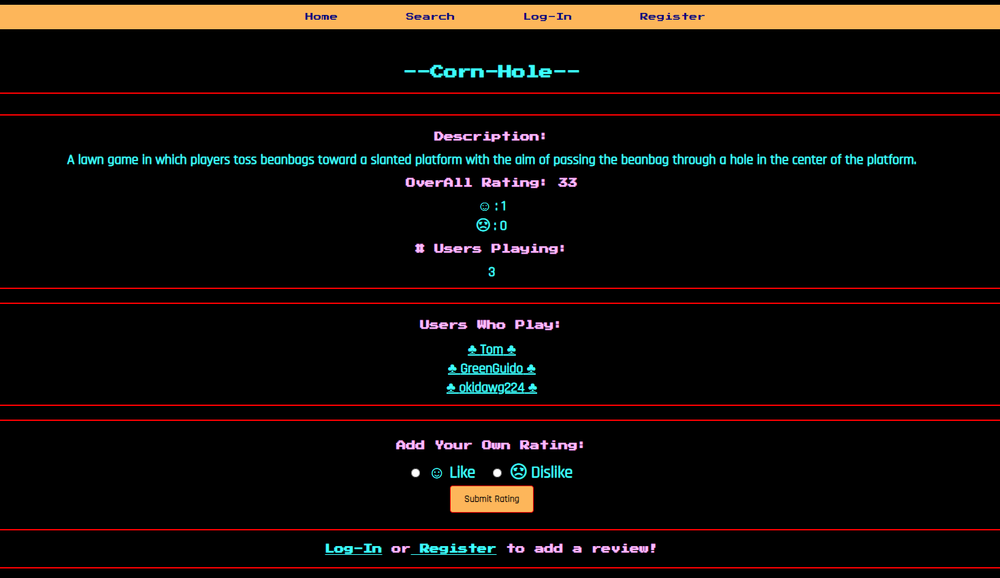

When the unauthorized user views a game
Then there is a link that can take them to register or login. User needs to login inorder to add reviews.

When an authorized user views a game
Then they can add the game to their profile if not already added. they can also like (thumbs up) or dislike (thumbs down) a game.

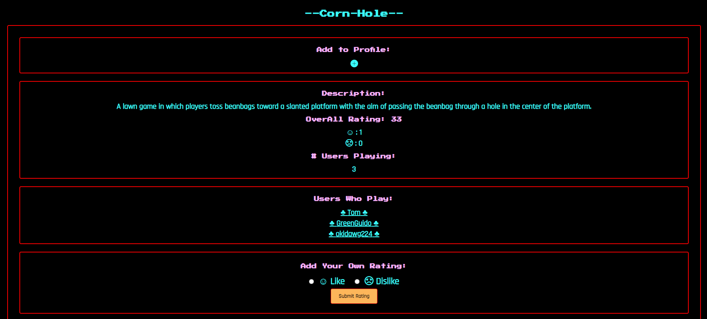

When an authorized user views a game
Then there is a form at the bottom of the game that can be submitted with their own inputted review.

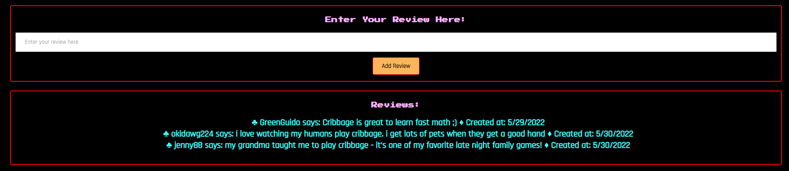

When an authorized user is on the home page
Then they can select the view profile link

When an authorized user is viewing their profile
Then they can see a list of their games within their game library and the reviews that accompany them, they can also remove a game from their library

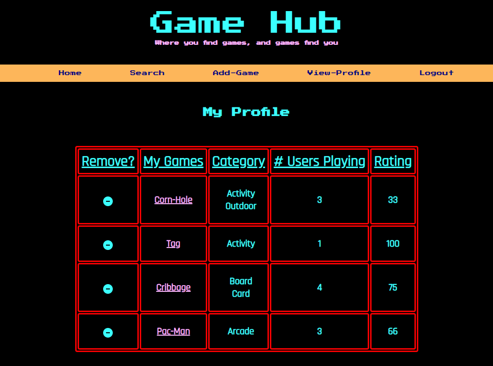

When an unauthorized/authorized user clicks on another users profile
Then they are taken to that users profile and can see what games are within their library

When an authorized user clicks on the add game link
Then they are brought to a page to add a UNIQUE game into the database(no duplicates)

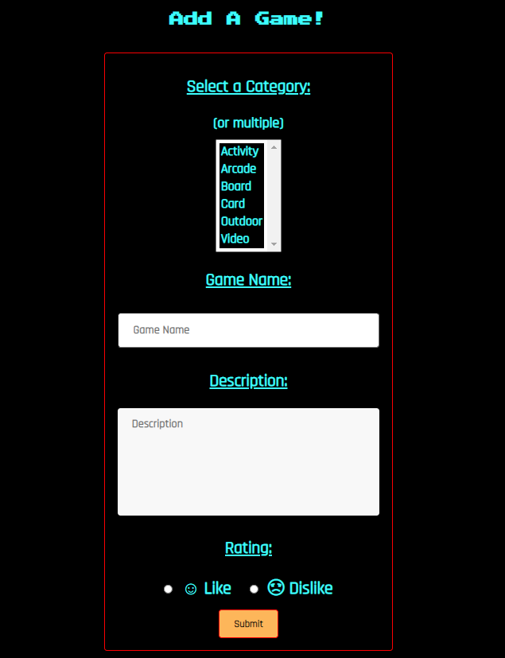

When an authorized user tries to add a game that already exists
Then the website will tell them that the game is already within the database

When an authorized user tries to add a UNIQUE game
Then they must fill out the category, name of the game and a description

When an authorized user successfully adds a game to the database
Then they are redirected to the modified home page

When a user clicks on the logout link from the modified home page
Then they are logged out and are redirected to the home page

## Credits

See the deployed website at: https://game-hub-2022.herokuapp.com/ 

Developers | Github
--- | ---
Jenny Sacco |
Priyanka Mary Christine | [marycpriyanka](https://github.com/marycpriyanka)
Anthony Ditore | [aditore](https://github.com/aditore)
Rebecca Yu |

This app was created with create-react-app 

## License

Game hub is available under the MIT License.

Copyright (c) [2022] [Anthony Ditore, Jenny Sacco, Priyanka Mary Christine, Rebecca Yu]

Permission is hereby granted, free of charge, to any person obtaining a copy of this software and associated documentation files (the "Software"), to deal in the Software without restriction, including without limitation the rights to use, copy, modify, merge, publish, distribute, sublicense, and/or sell copies of the Software, and to permit persons to whom the Software is furnished to do so, subject to the following conditions:

The above copyright notice and this permission notice shall be included in all copies or substantial portions of the Software.

THE SOFTWARE IS PROVIDED "AS IS", WITHOUT WARRANTY OF ANY KIND, EXPRESS OR IMPLIED, INCLUDING BUT NOT LIMITED TO THE WARRANTIES OF MERCHANTABILITY, FITNESS FOR A PARTICULAR PURPOSE AND NONINFRINGEMENT. IN NO EVENT SHALL THE AUTHORS OR COPYRIGHT HOLDERS BE LIABLE FOR ANY CLAIM, DAMAGES OR OTHER LIABILITY, WHETHER IN AN ACTION OF CONTRACT, TORT OR OTHERWISE, ARISING FROM, OUT OF OR IN CONNECTION WITH THE SOFTWARE OR THE USE OR OTHER DEALINGS IN THE SOFTWARE.

## Technologies used

- React
- CSS
- GraphQL(Apollo)
- Node.js
- Express.js
- MongoDB
- Mongoose
- bcrypt package
- JWT Authentication
- Heroku

